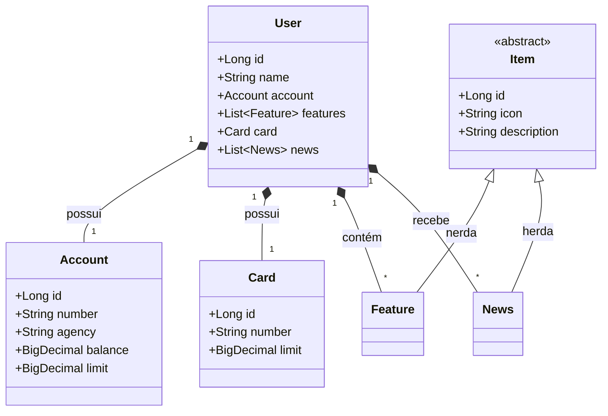
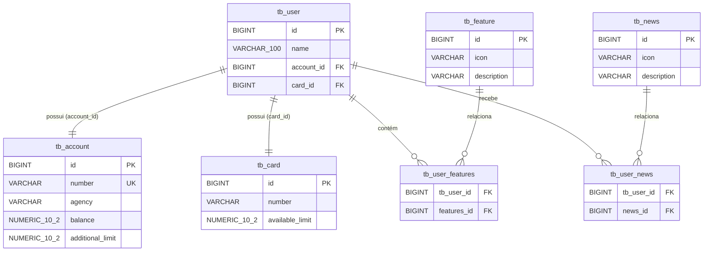

# 🏛️ Santander Dev Week 2023 — RESTful API com Java e Spring Boot

<br />

<div align="center">

[](https://www.oracle.com/java/)
[](https://spring.io/projects/spring-boot)
[](https://spring.io/projects/spring-data-jpa)
[](https://gradle.org/)
[](https://www.postgresql.org/)
[](https://swagger.io/)
[](LICENSE)
[](#)

</div>

---

## 🔗 Acesso e Documentação Interativa

A aplicação foi desenvolvida e arquitetada para execução em nuvem (preparada para plataformas como **Railway** através de `Procfile` e conexão PostgreSQL) e localmente com banco de dados em memória.

* **Swagger UI (Documentação Viva):** `http://localhost:8080/swagger-ui.html`
* **Especificação OpenAPI v3 (JSON):** `http://localhost:8080/v3/api-docs`
* **H2 Database Console (Ambiente Dev):** `http://localhost:8080/h2-console`
  * *JDBC URL:* `jdbc:h2:mem:sdw2023`
  * *User:* `sdw2023`
  * *Password:* *(em branco)*

---

## 📖 Visão Geral

Este projeto foi construído durante a **Santander Dev Week 2023**, promovida pela [Digital Innovation One (DIO)](https://www.dio.me/). Trata-se de uma **API RESTful completa em Java com Spring Boot 3**, inspirada nos módulos centrais do aplicativo bancário do **Banco Santander**.

A solução modela e gerencia os relacionamentos essenciais de uma conta bancária digital moderna:
* **Usuário Correntista (`User`):** Dados de identificação do cliente bancário.
* **Conta Bancária (`Account`):** Número de conta corrente, agência, saldo disponível e limite de cheque especial.
* **Cartão de Crédito/Débito (`Card`):** Número de identificação e limite aprovado para transações.
* **Funcionalidades Personalizadas (`Feature`):** Serviços, facilidades e ferramentas ativas no perfil do cliente (ex: Pix, Transferências, Investimentos).
* **Mural de Novidades (`News`):** Notícias, avisos institucionais e ofertas direcionadas ao usuário.

---

## ✨ Funcionalidades

* **Cadastro Completo de Correntista (`POST /users`):**
  * Criação transacional atômica de um novo cliente juntamente com sua conta, cartão, funcionalidades e novidades associadas em cascata (`CascadeType.ALL`).
  * Validação prévia de unicidade da conta bancária (`existsByAccountNumber`).
  * Resposta HTTP semântica padronizada com cabeçalho `Location` apontando para a URI do recurso recém-criado (`201 Created`).
* **Consulta por Identificador Único (`GET /users/{id}`):**
  * Recuperação de todas as informações estruturadas de um usuário específico.
  * Tratamento defensivo com retorno semântico `404 Not Found` em caso de identificador inexistente.
* **Listagem Geral de Usuários (`GET /users`):**
  * Consulta de todos os registros armazenados na base de dados.
* **Documentação Viva e Interativa via Swagger/OpenAPI:**
  * Interface gráfica integrada com [SpringDoc OpenAPI 2.8.6](https://springdoc.org/) para teste interativo e inspeção de esquemas de dados.

---

## 🎯 Diferenciais e Destaques Técnicos

1. **Persistência em Cascata Abrangente (`CascadeType.ALL`):** A entidade `User` atua como agregador raiz (Aggregate Root), permitindo que persistência, atualização e exclusão reflitam consistentemente em `Account`, `Card`, `Feature` e `News`.
2. **Abstração e Herança com `@MappedSuperclass`:** Reutilização limpa de código através da classe abstrata `Item`, compartilhando os atributos de `id`, `icon` e `description` entre as entidades filhas `Feature` e `News`.
3. **Precisão Monetária Rigorosa (`BigDecimal`):** Saldos e limites em `Account` e `Card` utilizam explicitamente `BigDecimal` com anotações `@Column(precision = 10, scale = 2)`, evitando problemas clássicos de arredondamento de ponto flutuante em dados financeiros.
4. **Isolamento de Perfis de Configuração:**
   * **Perfil `dev` (`application-dev.properties`):** Utiliza banco de dados em memória **H2** com geração automática de tabelas (`ddl-auto=create`), exibição de queries SQL formatadas no log e console web ativado.
   * **Perfil `prod` (`application-prod.properties`):** Configurado para **PostgreSQL** em produção com validação rigorosa de integridade estrutural (`ddl-auto=validate`), injeção segura de credenciais via variáveis de ambiente (`PGHOST`, `PGPORT`, `PGDATABASE`, `PGUSER`, `PGPASSWORD`) e supressão de stack traces em erros HTTP (`server.error.include-stacktrace=never`).
5. **Tratamento Centralizado de Erros (`@ControllerAdvice`):** Captura interceptada de exceções de banco de dados (`EntityNotFoundException`), garantindo respostas limpas sem vazamento de detalhes internos da arquitetura.
6. **Configuração de Servidor OpenAPI e Suporte a CORS:** Configuração da anotação `@OpenAPIDefinition(servers = {@Server(url = "/", description = "Default Server URL")})` para garantir resolução adequada de rotas tanto em localhost quanto atrás de proxies reversos de nuvem.

---

## 🏗️ Arquitetura e Estrutura de Pastas

O projeto adota a arquitetura em camadas tradicional do ecossistema corporativo Spring:

```bash
dio-java-spring-back-santander/
├── .gitattributes                             # Configuração de normalização de quebras de linha Git
├── .gitignore                                 # Exclusões de compilação, diretórios .gradle e artefatos IDE
├── build.gradle                               # Script de compilação e gerenciamento de dependências Gradle
├── gradlew                                    # Wrapper de execução do Gradle para Linux/macOS
├── gradlew.bat                                # Wrapper de execução do Gradle para Windows
├── Procfile                                   # Instrução de inicialização da JVM em ambientes Cloud (Railway)
├── README.md                                  # Documentação técnica do projeto
├── settings.gradle                            # Definição do nome do projeto raiz
├── gradle/wrapper/                            # Binários e propriedades do Gradle Wrapper (v8.13)
└── src/
    ├── main/
    │   ├── java/dev/ericky/santander_proj_2023/
    │   │   ├── SantanderProj2023Application.java   # Ponto de entrada (Main) e anotação OpenAPI
    │   │   ├── controller/                         # Camada de entrada REST (Controllers)
    │   │   │   ├── UserController.java             # Endpoints HTTP da rota /users
    │   │   │   └── exception/                      # Interceptadores de exceções globais
    │   │   │       └── GlobalExceptionHandler.java # @ControllerAdvice para EntityNotFoundException
    │   │   ├── model/                              # Camada de domínio e entidades JPA
    │   │   │   ├── Account.java                    # Entidade de Conta Bancária (tb_account)
    │   │   │   ├── Card.java                       # Entidade de Cartão (tb_card)
    │   │   │   ├── Feature.java                    # Entidade de Funcionalidades (tb_feature)
    │   │   │   ├── Item.java                       # Superclasse abstrata com id, icon e description
    │   │   │   ├── News.java                       # Entidade de Novidades (tb_news)
    │   │   │   └── User.java                       # Entidade Raiz de Usuário (tb_user)
    │   │   ├── repository/                         # Camada de persistência (Spring Data JPA)
    │   │   │   └── UserRepository.java             # Interface de acesso a dados e queries customizadas
    │   │   └── service/                            # Camada de regras de negócio
    │   │       ├── UserService.java                # Interface de contrato das operações de usuário
    │   │       └── impl/
    │   │           └── UserServiceImpl.java        # Implementação concreta dos serviços de usuário
    │   └── resources/
    │       ├── application-dev.properties          # Configurações de desenvolvimento (H2 Database)
    │       └── application-prod.properties         # Configurações de produção (PostgreSQL e Railway)
    └── test/
        └── java/dev/ericky/santander_proj_2023/
            └── SantanderProj2023ApplicationTests.java # Testes de integridade de contexto do Spring Boot
```

---

## 📊 Modelagem de Dados

### 1. Diagrama de Classes (Class Diagram)

Representação estrutural das classes de domínio e seus relacionamentos de composição:



---

### 2. Diagrama Entidade-Relacionamento (DER)

Mapeamento relacional das tabelas físicas geradas no banco de dados:



---

## 🎯 Padrões de Projeto e Práticas Implementadas

* **Inversão de Controle e Injeção de Dependências (IoC/DI):** Uso consistente de injeção por construtor em `UserController` e `UserServiceImpl`, garantindo imutabilidade dos componentes (`final`) e facilidade de substituição por instâncias simuladas (Mocks) em testes.
* **Separation of Concerns (SoC) em Camadas:**
  * **Controladores (`Controller`):** Exclusivamente responsáveis pela desserialização de requisições, roteamento e respostas HTTP com status semânticos adequados (`200 OK`, `201 Created`, `404 Not Found`).
  * **Serviços (`Service`):** Centralizam a lógica de negócios, como a verificação de duplicidade de contas e lançamento de exceções.
  * **Repositórios (`Repository`):** Abstraem as operações SQL em interfaces com Spring Data JPA.
* **Tratamento Centralizado de Exceções (`@ControllerAdvice`):** Desacoplamento entre o tratamento de erros e a lógica dos controladores.
* **Lombok para Redução de Boilerplate:** Uso de anotações `@Data` e `@NoArgsConstructor` para geração em tempo de compilação de métodos getters, setters, equals, hashCode e construtores padrão.

---

## 📋 Validações e Regras de Negócio

| Entidade / Recurso | Regra / Restrição Técnica | Comportamento Implementado |
| :--- | :--- | :--- |
| `Account` | Número da conta exclusivo (`@Column(unique = true)`) | Impede duplicidade no nível de banco e validação preventiva com `existsByAccountNumber`. |
| `Account` | `balance` e `additional_limit` | Precisão financeira restrita a 10 dígitos com 2 casas decimais (`NUMERIC(10, 2)`). |
| `Card` | `available_limit` | Precisão financeira restrita a 10 dígitos com 2 casas decimais (`NUMERIC(10, 2)`). |
| `User` | Tamanho do campo `name` | Restrição máxima de 100 caracteres (`@Column(length = 100)`). |
| `UserService` | Tentativa de cadastro de conta existente | Lança `IllegalArgumentException("Usuario já existe")`. |
| `UserService` | Consulta de usuário com ID inexistente | Lança `EntityNotFoundException`, interceptada e convertida em HTTP `404 Not Found`. |
| `User` | Cascata Total | Exclusão ou criação de `User` persiste/remove integralmente suas dependências (`tb_account`, `tb_card`, etc.). |

---

## ⚙️ Requisitos e Instalação

### Pré-requisitos
* **Java Development Kit (JDK):** Versão 17 LTS (ou superior).
* **Git:** Para clonagem e controle de versão.
* **Gradle:** O repositório já inclui os executáveis `gradlew` e `gradlew.bat`, não exigindo instalação prévia de ferramentas adicionais.

### Instalação

1. Clone o repositório em sua máquina:
```bash
git clone https://github.com/erickystn/dio-java-spring-back-santander.git
```

2. Entre no diretório do projeto:
```bash
cd dio-java-spring-back-santander
```

3. Compile e verifique a integridade do projeto:
```bash
./gradlew build
```
*(No Windows, utilize `gradlew.bat build`)*

---

## 🚀 Como Executar

### 1. Executando em Modo Desenvolvimento (Local com H2)
Por padrão ou ativando o perfil `dev`, a aplicação roda na porta `8080` com banco em memória:

```bash
./gradlew bootRun --args='--spring.profiles.active=dev'
```

Ao iniciar, a API estará acessível em:
* Endpoints base: `http://localhost:8080/users`
* Swagger UI: `http://localhost:8080/swagger-ui.html`
* H2 Console: `http://localhost:8080/h2-console`

### 2. Executando em Modo Produção (com PostgreSQL)
Para rodar apontando para um banco de dados PostgreSQL (local, Docker ou Railway), exporte as variáveis de ambiente necessárias e inicie com o perfil `prod`:

```bash
export PGHOST=localhost
export PGPORT=5432
export PGDATABASE=santander_db
export PGUSER=seu_usuario
export PGPASSWORD=sua_senha

./gradlew bootRun --args='--spring.profiles.active=prod'
```

### 3. Executando via JAR Compilado
```bash
./gradlew clean bootJar
java -jar build/libs/santander-proj-2023-0.0.1-SNAPSHOT.jar
```

---

## 💻 Exemplos de Uso e Código (Endpoints)

### Resumo das Rotas

| Método | Endpoint | Descrição | Status de Sucesso |
| :---: | :--- | :--- | :---: |
| `POST` | `/users` | Cadastra um novo cliente bancário completo | `201 Created` |
| `GET` | `/users` | Retorna a lista consolidada de todos os usuários | `200 OK` |
| `GET` | `/users/{id}` | Retorna os dados completos do usuário correspondente | `200 OK` |

---

### Exemplo 1: Cadastro de Usuário (`POST /users`)

**Requisição:**
```http
POST /users HTTP/1.1
Host: localhost:8080
Content-Type: application/json

{
  "name": "Ericky Sant'ana",
  "account": {
    "number": "00001234-5",
    "agency": "0001",
    "balance": 1500.75,
    "limit": 1000.00
  },
  "card": {
    "number": "xxxx xxxx xxxx 4321",
    "limit": 5000.00
  },
  "features": [
    {
      "icon": "https://img.icons8.com/pix",
      "description": "Chave Pix CPF Ativa"
    },
    {
      "icon": "https://img.icons8.com/invest",
      "description": "CDB Renda Fixa Santander"
    }
  ],
  "news": [
    {
      "icon": "https://img.icons8.com/news",
      "description": "O Santander preparou uma nova oferta de crédito exclusiva para você!"
    }
  ]
}
```

**Resposta (`201 Created`):**
```http
HTTP/1.1 201 Created
Location: http://localhost:8080/users/1
Content-Type: application/json

{
  "id": 1,
  "name": "Ericky Sant'ana",
  "account": {
    "id": 1,
    "number": "00001234-5",
    "agency": "0001",
    "balance": 1500.75,
    "limit": 1000.00
  },
  "card": {
    "id": 1,
    "number": "xxxx xxxx xxxx 4321",
    "limit": 5000.00
  },
  "features": [
    {
      "id": 1,
      "icon": "https://img.icons8.com/pix",
      "description": "Chave Pix CPF Ativa"
    },
    {
      "id": 2,
      "icon": "https://img.icons8.com/invest",
      "description": "CDB Renda Fixa Santander"
    }
  ],
  "news": [
    {
      "id": 1,
      "icon": "https://img.icons8.com/news",
      "description": "O Santander preparou uma nova oferta de crédito exclusiva para você!"
    }
  ]
}
```

---

### Exemplo 2: Consulta por ID (`GET /users/1`)

**Requisição:**
```http
GET /users/1 HTTP/1.1
Host: localhost:8080
```

**Resposta (`200 OK`):**
Retorna o payload JSON completo do correntista especificado. Caso o ID não exista na base, a resposta interceptada é:

```http
HTTP/1.1 404 Not Found
Content-Type: text/plain;charset=UTF-8

Entity not Found
```

---

## 🧪 Suíte de Testes

A suíte de testes unitários e de integração utiliza o framework **JUnit 5** em conjunto com as anotações do **Spring Boot Starter Test**.

Para executar a bateria de testes automatizados:
```bash
./gradlew test
```

Os relatórios detalhados de execução em HTML são gerados automaticamente pelo Gradle em:
`build/reports/tests/test/index.html`.

---

## 🛠️ Tecnologias Utilizadas

| Tecnologia | Versão | Finalidade |
| :--- | :--- | :--- |
| **[Java](https://www.oracle.com/java/)** | 17 LTS | Linguagem de programação principal utilizada no desenvolvimento da API. |
| **[Spring Boot](https://spring.io/projects/spring-boot)** | 3.4.4 | Framework base para construção rápida de microsserviços e aplicações web robustas. |
| **[Spring Data JPA](https://spring.io/projects/spring-data-jpa)** | — | Camada de abstração de dados e repositórios automáticos. |
| **[Hibernate](https://hibernate.org/)** | — | Provedor de Mapeamento Objeto-Relacional (ORM) padrão do Spring. |
| **[SpringDoc OpenAPI](https://springdoc.org/)** | 2.8.6 | Geração dinâmica de contratos Swagger UI e especificação OpenAPI v3. |
| **[H2 Database](https://www.h2database.com/)** | — | Banco de dados SQL em memória utilizado para agilidade no ambiente de desenvolvimento (`dev`). |
| **[PostgreSQL](https://www.postgresql.org/)** | — | Banco de dados relacional robusto configurado para o ambiente de produção (`prod`). |
| **[Lombok](https://projectlombok.org/)** | — | Biblioteca para geração automática de métodos assessores, construtores e utilitários Java. |
| **[Gradle](https://gradle.org/)** | 8.13 | Gerenciador e automatizador de compilação, testes e dependências do projeto. |
| **[Railway](https://railway.app/)** | — | Plataforma de nuvem direcionada via `Procfile` para implantação simplificada de microsserviços. |

---

## 📈 Melhorias e Próximos Passos (Roadmap)

- [ ] **Data Transfer Objects (DTOs):** Implementar classes Java `Record` dedicadas como DTOs para separar a camada de persistência JPA da camada de apresentação HTTP.
- [ ] **Validação com Bean Validation (`@Valid`):** Adicionar anotações como `@NotBlank`, `@Positive` e validações de dígitos verificadores de conta/agência.
- [ ] **Segurança e Autenticação com Spring Security:** Adicionar suporte a autenticação stateless via tokens JWT para proteção das rotas de usuário.
- [ ] **Operações de Atualização e Exclusão (PUT / DELETE):** Completar o ciclo CRUD disponibilizando endpoints para cancelamento de cartões e atualização cadastral.
- [ ] **Paginação e Ordenação:** Incorporar `Pageable` e `Sort` do Spring Data nos endpoints de listagem de usuários.
- [ ] **Testes de Integração com Testcontainers:** Adicionar testes ponta a ponta com instâncias de banco PostgreSQL reais executadas em containers Docker.

---

## 🤝 Como Contribuir

1. Faça um **Fork** do repositório.
2. Crie uma branch com a sua melhoria:
   ```bash
   git checkout -b feature/minha-melhoria
   ```
3. Realize seus commits seguindo o padrão de commits semânticos:
   ```bash
   git commit -m "feat: adiciona DTOs e Bean Validation no cadastro de usuarios"
   ```
4. Envie as alterações para o seu fork:
   ```bash
   git push origin feature/minha-melhoria
   ```
5. Abra um **Pull Request** detalhado para revisão.

---

## 👤 Autor & Créditos

* **Desenvolvedor:** [Ericky Sant'ana](https://github.com/erickystn)
* **Origem Educacional:** Projeto desenvolvido no âmbito da **Santander Dev Week 2023** proporcionada pela [Digital Innovation One (DIO)](https://www.dio.me/).

---

## 📄 Licença

Este projeto está licenciado sob os termos da licença **MIT**. Consulte o arquivo de licença ou sinta-se à vontade para estudar, clonar e aperfeiçoar a implementação.
